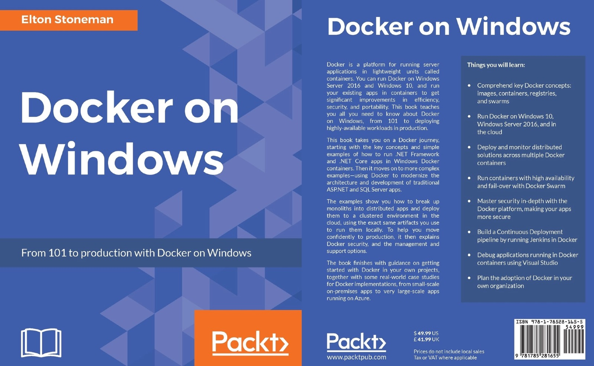

# Docker on Windows

This is all the source code for the samples in my book [Docker on Windows](https://www.amazon.co.uk/Docker-Windows-Elton-Stoneman-ebook/dp/B0711Y4J9K), published by Packt.

> There are two editions of the book. This is the latest edition, which covers Docker on Windows Server 2019, and that's what you should be using. If you're still using Windows Server 2016 then you want [the first edition](https://github.com/sixeyed/docker-on-windows/tree/first-edition-final).

Every Dockerfile is in this repo, and all the images are also available on Docker Hub at the [dockeronwindows](https://hub.docker.com/r/dockeronwindows/) organization.

It's a comprehensive look at running Docker on Windows, covering everything from 101 to production over 12 chapters.

## Weekly Dockerfile

I've also got a blog series describing all the Dockerfiles in detail: [Weekly Windows Dockerfiles](https://blog.sixeyed.com/tag/weekly-dockerfile/)

## The Missing Preface

Somewhere between the author's laptop, the publisher's content system and the printing press, the preface I wrote didn't make it into the final book. You can read it [here](preface.md).

## Contents

1. Getting Started with Docker on Windows
	
2. Packaging and Running Applications as Docker Containers
	
3. Developing Dockerized .NET and .NET Core Applications

4. Pushing and Pulling Images from Docker Registries
	
5. Adopting Container-First Solution Design
	
6. Organizing Distributed Solutions with Docker Compose
	
7. Orchestrating Distributed Solutions with Docker Swarm
	
8. Administering and Monitoring Dockerized Solutions
	
9. Understanding the Security Risks and Benefits of Docker
	
10. Powering a Continuous Deployment Pipeline with Docker
	
11. Debugging and Instrumenting Application Containers
	
12. Containerize What You Know: Guidance for Implementing Docker

## Cover Art

## Reviews

* [Amazon - customer reviews for Docker on Windows, Second Edition](https://www.amazon.com/Docker-Windows-101-production-2nd/dp/1789617375/#customerReviews)

* [InfoQ - Q&A for Docker on Windows, Second Edition](https://www.infoq.com/articles/book-docker-windows-second-edition/)

* [Amazon - customer reviews for Docker on Windows, First Edition](https://www.amazon.com/gp/product/1785281658/#customerReviews)

* [InfoQ - Book Review Docker on Windows by Elton Stoneman](https://www.infoq.com/news/2017/08/docker-windows-elton-stoneman)

* [實戰 Docker｜使用 Windows Server 2016/Windows 10](https://www.tenlong.com.tw/products/9789864767915) (Traditional Chinese, Taiwan)
