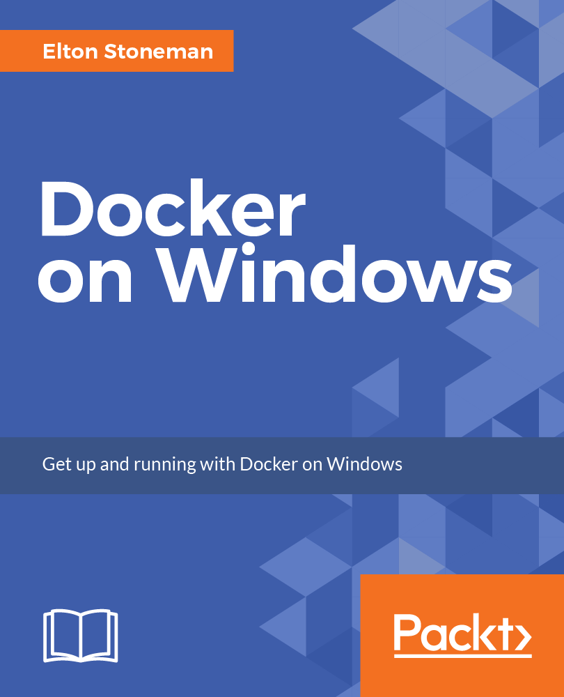

# Docker on Windows

This is all the source code for the samples in my book [Docker on Windows](https://www.amazon.co.uk/Docker-Windows-Elton-Stoneman-ebook/dp/B0711Y4J9K), published by Packt.

Every Dockerfile is also available on Docker Hub at the [dockeronwindows](https://hub.docker.com/r/dockeronwindows/) organization.

It's a comprehensive look at running Docker on Windows, covering everything from 101 to production over 12 chapters.

## Contents

1. Getting Started with Docker on Windows
	
2. Packaging and Running Applications as Docker Containers
	
3. Developing Dockerized .NET and .NET Core Applications

4. Pushing and Pulling Images from Docker Registries
	
5. Adopting Container-First Solution Design
	
6. Organizing Distributed Solutions with Docker Compose
	
7. Orchestrating Distributed Solutions with Docker Swarm
	
8. Administering and Monitoring Dockerized Solutions
	
9. Understanding the Security Risks and Benefits of Docker
	
10. Powering a Continuous Deployment Pipeline with Docker
	
11. Debugging and Instrumenting Application Containers
	
12. Containerize What You Know: Guidance for Implementing Docker

## Cover Art

